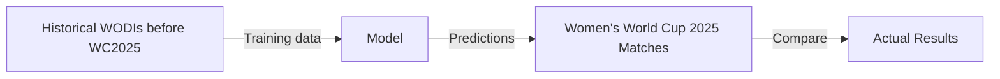
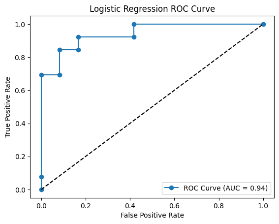

# Women’s Cricket World Cup 2025 Outcome Prediction


## Overview

This project aims to predict match outcomes for the **Women’s Cricket World Cup 2025** using historical Women’s ODI (WODI) match data.

Raw ball-by-ball data from [Cricsheet](https://cricsheet.org/) is ingested into a **PostgreSQL relational database**, which serves as the primary source.
Match-level features are generated directly from the database using dbt SQL models, and are then used to train and evaluate supervised machine learning models.

The project is designed such that only information available prior to a match is used for training and evaluation.

---

## Problem Statement

Given match-level features derived from historical ball-by-ball data, **can we predict the outcome of a Women’s Cricket World Cup match?**

This is formulated as a **supervised learning** problem:

* **Training data:** WODIs played before WC 2025
* **Evaluation data:** Matches from the Women’s Cricket World Cup 2025

---

## Modeling Workflow



---

## Results

Three models were trained and evaluated on the World Cup 2025 matches dataset.

| Model               | CV Mean Accuracy | CV Mean Log Loss | Accuracy | F1-Score |
|---------------------|------------------|------------------|----------|----------|
| Baseline Classifier | 74%              | -                | 88%      | 0.88     |
| Logistic Regression | 74%              | 0.54             | 88%      | 0.88     |
| Random Forest       | 67%              | -                | 88%      | 0.88     |




Across cross-validation folds, logistic regression performs similarly
to the naive baseline classifier. This occurs because logistic regression
essentially learns a threshold decision rule on the `delta_team_strength`
feature.

Random Forest does not improve predictive performance, suggesting that
the relationship between the features and match outcome is largely linear.

These results indicate that relative team strength is the dominant factor
in determining match outcomes in Women’s ODIs.

---


## Installation

### Prerequisites

* Python 3.10+
* PostgreSQL 14+
* Git

### 1. Clone the repository

```shell
git clone https://github.com/shsiddhant/womens-wc.git
cd womens-wc
```

### 2. Create and activate a virtual environment

#### A. Using `uv`

```shell
uv venv .venv --seed
source .venv/bin/activate
uv sync
```

#### B. Using `pip`

```shell
python -m venv .venv
source .venv/bin/activate
pip install .
```

---

## Data Source

### Raw Data

* **Source:** [Cricsheet](https://cricsheet.org/)
* **Format:** JSON (one file per match)
* **Granularity:** Ball-by-ball
* **Coverage:** All available Women’s ODIs

Raw data files are not included in the repository to keep it lightweight.

### Obtaining Raw Data

1. Download the WODI JSON files from
   [https://cricsheet.org/downloads/](https://cricsheet.org/downloads/odis_female_json.zip)
2. Unzip and place the files inside:

```text
data/raw/
```

---

## Database and Data Pipeline

This project uses PostgreSQL as the **canonical data store** for all cricket data.

### Database Schema

- Ball-by-ball match data stored in normalized relational tables
- Key tables: venues, matches, players, teams, innings, deliveries
- Derived tables provide aggregated stats for analytics and modeling
- Primary analytical tables: `fct_features`, `fct_target`


### Pipeline

The pipeline consists of two layers:

1. **Ingestion:** A python script `scripts/python/ingest.py` parses raw Cricsheet JSON data, partially flattens it, and copies it to raw source tables - `womenswc.raw_json` and `womenswc.deliveries_json`.   
2. **Intermediate tables:** dbt models transform data from raw source tables into full normalized relational tables. These act as our source for analytic tables.
3. **Analytical Marts:** dbt models generate match-level analytical tables from intermediate relational tables. Amongst these are our *features* and *target* tables. 
4. **Snapshots:** For convenience of running notebooks, CSV snapshots of the feature and target datasets are provided in the directory `data/processed`. 

---

## Feature Dataset

Each row in the feature dataset represents a single match, with features computed
for both teams using only information available prior to the match date.

### Team Representation

To avoid positional or ordering bias:

* Teams are assigned to columns `team` and `opponent` at random.
* Corresponding features (batting, bowling, win percentage, etc.) are aligned to these randomized team assignments.

This prevents the model from learning patterns based on team ordering, home/away conventions, or alphabetical bias.

### Features

Features are computed for both teams in each match:

1. Home advantage
2. Chasing Advantage
3. Team Strength Differential

Team Strength is calculated using (exponential decay weighted) cumulative stats: 

```
0.01 * Win Percentage * Batting Average / Bowling Average
```

### Using the Feature Dataset

There are two supported ways to work with the feature dataset:

1. **Database Pipeline**

	Run the ingestion script:

	```shell
		 cd womens-wc
		 python scripts/python.ingest.py
	```
	  
	     
	Then run dbt:
	
	```shell
		 cd womens-wc/dbt_cricket
		 dbt build -f
	```
	   
   **Note:** Requires a running PostgreSQL database and properly configured dbt.

2. **Snapshots**

Pre-generated feature dataset provided in `data/processed/`. This allows the notebooks to be run without setting up a database.

---

## Using the Notebooks

Activate the environment and launch JupyterLab:

```shell
source .venv/bin/activate
jupyter lab notebooks/
```

---

## Tools and Libraries

* Python
* PostgreSQL
* dbt
* pandas
* numpy
* matplotlib
* scikit-learn
* psycopg2
* Jupyter

---

## License

[MIT](LICENSE)
