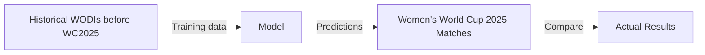

# Women’s Cricket World Cup Outcome Prediction

## Overview

This project aims to predict match outcomes for the **Women’s Cricket World Cup 2025**
using historical Women’s ODI (WODI) match data.

Raw ball-by-ball data from [Cricsheet](https://cricsheet.org/) is ingested into a
**PostgreSQL relational database**, which serves as the primary source.
Match-level features are generated directly from the database using SQL and Python
and are then used to train and evaluate supervised machine learning models.

The project is designed to mirror a real-world prediction workflow, where only
information available *prior* to a match is used for training and evaluation.

---

## Problem Statement

Given match-level features derived from historical ball-by-ball data,
**can we predict the outcome of a Women’s Cricket World Cup match?**

This is formulated as a **supervised learning** problem:

* **Training data:** Matches played after the Women’s Cricket World Cup 2022 and before WC 2025
* **Evaluation data:** Matches from the Women’s Cricket World Cup 2025

Temporal cutoffs are enforced throughout the pipeline to prevent data leakage.

---

## Project Workflow

1. Ingest raw Cricsheet JSON data into PostgreSQL
2. Normalize and transform ball-by-ball data using SQL
3. Generate match-level features directly from the database using date cutoffs
4. Optionally persist feature datasets for reproducibility and experimentation
5. Train and evaluate machine learning models



---

## Installation

### Prerequisites

* Python 3.10+
* PostgreSQL 14+
* Git

### 1. Clone the repository

```shell
git clone https://github.com/shsiddhant/womens-wc.git
cd womens-wc
```

### 2. Create and activate a virtual environment

#### A. Using `uv`

```shell
uv venv .venv --seed
source .venv/bin/activate
uv sync
```

#### B. Using `pip`

```shell
python -m venv .venv
source .venv/bin/activate
pip install .
```

---

## Data Source

### Raw Data

* **Source:** [Cricsheet](https://cricsheet.org/)
* **Format:** JSON (one file per match)
* **Granularity:** Ball-by-ball
* **Coverage:** All available Women’s ODIs

Raw data files are not included in the repository to keep it lightweight.

### Obtaining Raw Data

1. Download the WODI JSON files from
   [https://cricsheet.org/downloads/](https://cricsheet.org/downloads/odis_female_json.zip)
2. Unzip and place the files inside:

```text
data/raw/
```

---

## Database and Data Pipeline

This project uses PostgreSQL as the **canonical data store** for all cricket data.

### Database Layer

* **Database:** PostgreSQL
* **Granularity:** Ball-by-ball
* **Schema:** Normalized relational tables (matches, innings, deliveries, players, etc.)
* **Coverage:** All Women’s ODIs available on Cricsheet

---

### SQL Scripts (`scripts/sql/`)

The SQL scripts define the complete lifecycle of the data pipeline:

1. **Initialization**

   * Creates schemas, tables, constraints etc
   * Intended to be run once per database

2. **Ingestion and Transformation**

   * Parses raw Cricsheet JSON data
   * Inserts ball-by-ball data into normalized tables
   * Applies data cleaning and transformations
   

3. **Feature Building**

   * Aggregates ball-by-ball data into match-level features
   * Uses parameterized SQL queries (`%s`) via psycopg2
   * Produces feature-ready datasets for ML workflows
   * Supports configurable date cutoffs

All SQL queries use parameterized placeholders to safely handle dynamic inputs such as
date ranges.

---

## Python Modules

Python code lives in:

```text
src/womenswc/
```

These modules are responsible for:

* Managing PostgreSQL connections
* Executing SQL scripts with runtime parameters
* Coordinating feature generation from the database

Functions are designed to accept database connection objects, keeping database logic
decoupled from execution context and improving reusability.

---

## Data Processing and Feature Engineering

Raw ball-by-ball data is ingested into PostgreSQL and transformed using SQL queries.
Match-level features are computed **directly from the database**, without creating
an intermediate persisted base dataset.

This design avoids duplication of data and keeps PostgreSQL as the single source of truth.

---

## Feature Dataset

Each row in the feature dataset represents a single match, with features computed
for both teams using only information available prior to the match date.

### Team Representation and Bias Mitigation

To avoid positional or ordering bias:

* Teams are assigned to columns `team` and `opponent` **at random**.
* Corresponding features (batting, bowling, win percentage, etc.) are aligned to
  these randomized team assignments.

This prevents the model from learning spurious patterns based on team ordering,
home/away conventions, or alphabetical bias.

---

### Reproducibility vs Convenience

There are two supported ways to work with the feature dataset:

1. **Dynamic generation (recommended)**

   * Features are built by querying PostgreSQL
   * Fully customizable date cutoffs
   * Prevents data leakage
   * Requires a running database

2. **Pre-generated dataset (convenience)**

   * A snapshot of the feature table is included in the repository
   * Allows notebooks to be run without PostgreSQL
   * Feature definitions and date cutoffs are fixed

The pre-generated feature dataset CSV can be found inside `data/processed/`

For custom date ranges, feature modifications, or extension to new tournaments,
the PostgreSQL-backed pipeline should be used.

---

### Design Note

Feature datasets are intentionally snapshot-based when persisted to disk.
This ensures experiments are reproducible even as the underlying database or
feature logic evolves.

---

## Features (So Far)

Features are computed for **both teams** in each match:

1. Home advantage
2. Chasing Advantage
3. Team Strength Differential

Team Strength is calculated using (exponential decay weighted) cumulative stats: `0.01 * Win Percentage * Batting Average / Bowling Average`

Future feature additions may include:

* Venue-specific effects
* Spin vs pace bowling strength
* Opposition-adjusted metrics

---

## Using the Notebooks

Activate the environment and launch JupyterLab:

```shell
source .venv/bin/activate
jupyter lab notebooks/
```

The notebooks can be run in two modes:

* **Offline mode:** Load the pre-generated feature dataset from
  `data/processed/`
* **Database-backed mode:** Query PostgreSQL to dynamically generate features using
  custom date cutoffs

By default, notebooks use the pre-generated dataset for ease of use.

---

## Roadmap

* [x] Build PostgreSQL-backed data pipeline
* [x] Feature engineering
* [ ] Exploratory data analysis
* [ ] Train baseline ML models
* [ ] Evaluate model performance
* [ ] Document results and insights

---

## Tools and Libraries

* Python
* PostgreSQL
* pandas
* numpy
* matplotlib
* scikit-learn
* psycopg2
* Jupyter

---

## License

[](LICENSE)
