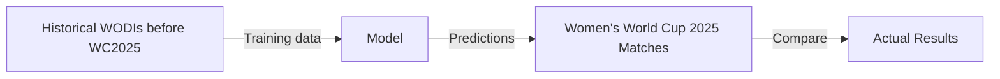

# Women’s Cricket World Cup 2025 Outcome Prediction

## Overview

This project aims to predict match outcomes for the **Women’s Cricket World Cup 2025** using historical Women’s ODI (WODI) match data.

Raw ball-by-ball data from [Cricsheet](https://cricsheet.org/) is ingested into a **PostgreSQL relational database**, which serves as the primary source.
Match-level features are generated directly from the database using dbt SQL models, and are then used to train and evaluate supervised machine learning models.

The project is designed such that only information available prior to a match is used for training and evaluation.

---

## Problem Statement

Given match-level features derived from historical ball-by-ball data, **can we predict the outcome of a Women’s Cricket World Cup match?**

This is formulated as a **supervised learning** problem:

* **Training data:** Matches played after the Women’s Cricket World Cup 2022 and before WC 2025
* **Evaluation data:** Matches from the Women’s Cricket World Cup 2025

Temporal cutoffs are enforced throughout the pipeline to prevent data leakage.

---

## Machine Learning



---

## Installation

### Prerequisites

* Python 3.10+
* PostgreSQL 14+
* Git

### 1. Clone the repository

```shell
git clone https://github.com/shsiddhant/womens-wc.git
cd womens-wc
```

### 2. Create and activate a virtual environment

#### A. Using `uv`

```shell
uv venv .venv --seed
source .venv/bin/activate
uv sync
```

#### B. Using `pip`

```shell
python -m venv .venv
source .venv/bin/activate
pip install .
```

---

## Data Source

### Raw Data

* **Source:** [Cricsheet](https://cricsheet.org/)
* **Format:** JSON (one file per match)
* **Granularity:** Ball-by-ball
* **Coverage:** All available Women’s ODIs

Raw data files are not included in the repository to keep it lightweight.

### Obtaining Raw Data

1. Download the WODI JSON files from
   [https://cricsheet.org/downloads/](https://cricsheet.org/downloads/odis_female_json.zip)
2. Unzip and place the files inside:

```text
data/raw/
```

---

## Database and Data Pipeline

This project uses PostgreSQL as the **canonical data store** for all cricket data.

### Database Layer

* **Database:** PostgreSQL
* **Granularity:** Ball-by-ball
* **Schema:** Normalized relational tables (matches, innings, deliveries, players, etc.)
* **Coverage:** All Women’s ODIs available on Cricsheet


### Pipeline

The pipeline consists of two layers:

1. **Ingestion:** A python script `scripts/python/ingest.py` parses raw Cricsheet JSON data, partially flattens it, and copies it to raw source tables `womenswc.raw_json` and `womenswc.deliveries_json`.   
2. **Intermediate tables:** We create intermediate dbt models that load data from raw source tables and create a full normalized relational tables. These act as our source for analytic tables.
3. **Analytic Marts:** We create analytics models from intermediate relational tables. Amongst these are our *features* and *target* tables. 
4. **Snapshots:** For convenience of running notebooks, we've provided CSV snapshots of the feature and target datasets. The files may be found in the directory `data/processed`. 

---

## Feature Dataset

Each row in the feature dataset represents a single match, with features computed
for both teams using only information available prior to the match date.

### Team Representation and Bias Mitigation

To avoid positional or ordering bias:

* Teams are assigned to columns `team` and `opponent` **at random**.
* Corresponding features (batting, bowling, win percentage, etc.) are aligned to
  these randomized team assignments.

This prevents the model from learning spurious patterns based on team ordering,
home/away conventions, or alphabetical bias.


### Using the Feature Dataset

There are two supported ways to work with the feature dataset:

1. **Dynamic generation**
	 - Run the ingestion script
		 ```shell
		 cd womens-wc
		 python scripts/python.ingest.py
		 ```
	  
	     
	- Run the dbt build command
		```shell
		 cd womens-wc/dbt_cricket
		 dbt build -f
		```
	   
   * Requires a running PostgreSQL database and properly configured dbt.

2. **Snapshots**

   - For convenience of running notebooks, we've provided CSV snapshots of the feature and target datasets. The files may be found in the directory `data/processed`.

The pre-generated feature dataset CSV can be found inside `data/processed/`

For custom date ranges, feature modifications, or extension to new tournaments,
the PostgreSQL-backed pipeline should be used.

---

## Features

Features are computed for **both teams** in each match:

1. Home advantage
2. Chasing Advantage
3. Team Strength Differential

Team Strength is calculated using (exponential decay weighted) cumulative stats: `0.01 * Win Percentage * Batting Average / Bowling Average`

Future feature additions may include:

* Venue-specific effects
* Player matchups
* Opposition-adjusted metrics

---

## Using the Notebooks

Activate the environment and launch JupyterLab:

```shell
source .venv/bin/activate
jupyter lab notebooks/
```

---

## Roadmap

* [x] Build PostgreSQL-backed data pipeline
* [x] Feature engineering
* [x] Exploratory data analysis
* [x] Train ML models
* [x] Evaluate model performance
* [x] Document results and insights

---

## Tools and Libraries

* Python
* PostgreSQL
* dbt
* pandas
* numpy
* matplotlib
* scikit-learn
* psycopg2
* Jupyter

---

## License

[](LICENSE)
